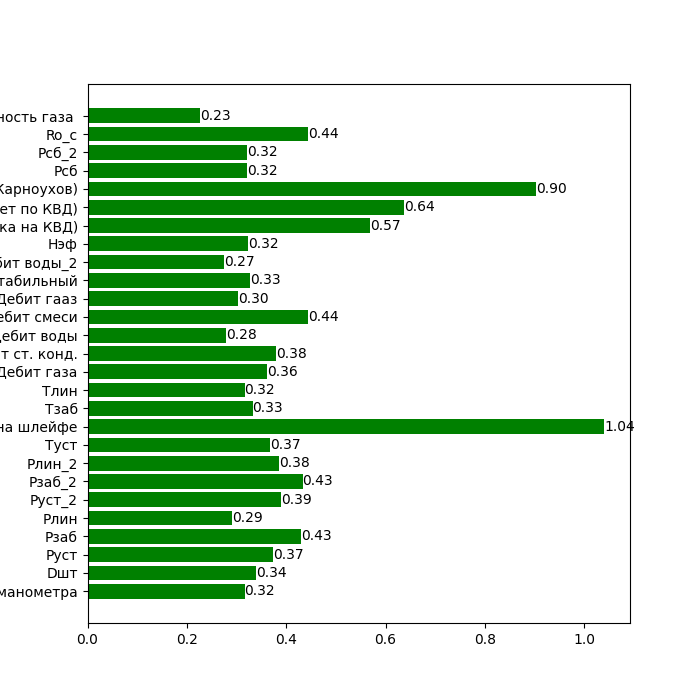

# TPNS1

Сначала нужно совместить два столбца КГФ, затем удалить строки в которых КГФ и G_total пустые. После этого считаем для всех столбцов такие значения как: мощность, процент пропусков, квантили, медиану. Сразу убирем столбцы в которых больше 60% пропусков, это Ro_g и Ro_w. Строим гистограммы.

### Гистограммы распределений

Категориальными признаками считаем те у которых мощность меньше 25
Ищем столбцы похожие на нормальное распределение: 'Руст', 'Рзаб', 'Рлин', 'Рлин_2', 'Дебит кон нестабильный'. Для них убираем выбросы по методу описаному в презентации для нормального распредения, для всех других столбцов убираем выбросы по другому методу из презентации.
### Гистограммы распределений после того как выбросы были убраны

Считаем gain ratio по формулам из презентации
### gain ratio

### карта корреляций

Находим столбцы которые коррелируют между собой (коэффициент корреляции >= 0.9), и из них оставлянем только тот у которого gain ratio больше.
Удаляем 'Руст', 'Руст_2', 'Рзаб_2', 'Дебит газа', 'Дебит гааз', 'Дебит кон нестабильный', 'Дебит воды_2', 'Pсб_2', 'Рпл. Тек (Расчет по КВД)'
